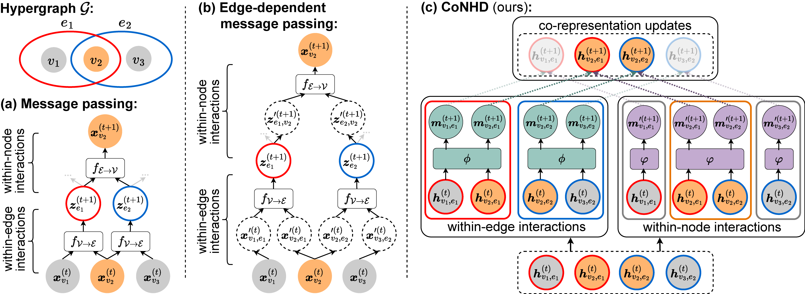

# CoNHD: Co-Representation Neural Hypergraph Diffusion

[](https://arxiv.org/abs/2405.14286)
[](https://github.com/zhengyijia/CoNHD)

CoNHD is a hypergraph neural network tailored for modeling node features specific to each hyperedge. This repository contains the official implementation of CoNHD. For more details, pleasse check our [paper](https://arxiv.org/abs/2405.14286).

<p align="left">
    
</p>

## 🎉 News
- 📢 Our paper "[Modeling Edge-Specific Node Features through Co-Representation Neural Hypergraph Diffusion](https://arxiv.org/abs/2405.14286)" has been accepted by CIKM 2025 (Full Research Paper Track)!

## Getting Started

### Clone Repo

```shell
git lfs install
GIT_LFS_SKIP_SMUDGE=0 git clone git@github.com:zhengyijia/CoNHD.git
cd CoNHD
```

### Environment Setup

The code has been tested with Python 3.8 and CUDA 11.3. To set up the environment, run the following commands:

```shell
conda create -n conhd_env python=3.8
conda activate conhd_env
bash install.sh
pip install -r requirements.txt
```

### Preprocessing

The datasets can be preprocessed using the following commands, which generates the initial node features through hypergraph random walks:

```shell
cd script
bash ./preprocess.sh
```

### Training and Evaluation

Run the following commands to train CoNHD on each ENC dataset and obtain the corresponding evaluation results: 

```shell
cd script/edge_dependent_node_classification
bash ./run_[emailEnron, emailEu, StackOverflowBiology, StackOverflowPhysics, DBLP, AMinerAuthor, cora_outsider, dblp_outsider, citeseer_outsider, pubmed_outsider].sh
```

## Acknowledgements

This project benefits from the following repositories:

- [WHATsNet](https://github.com/young917/EdgeDependentNodeLabel): The general training pipeline is based on the implementation of WHATsNet. 

- [EDHNN](https://github.com/Graph-COM/ED-HNN): The implementation of diffusion operators builds upon the EDHNN implementation.

- [AllSet](https://github.com/jianhao2016/AllSet): The outsider identification datasets are curated from the corresponding datasets provided by AllSet.

We sincerely appreciate the developers of the above repositories.

## Citation

If you find this work useful or use this work in your research, please consider citing our paper:

```
@misc{zheng2024co,
      title={Co-Representation Neural Hypergraph Diffusion for Edge-Dependent Node Classification}, 
      author={Yijia Zheng and Marcel Worring},
      year={2024},
      eprint={2405.14286},
      archivePrefix={arXiv},
      primaryClass={cs.LG},
      url={https://arxiv.org/abs/2405.14286}, 
}
```
